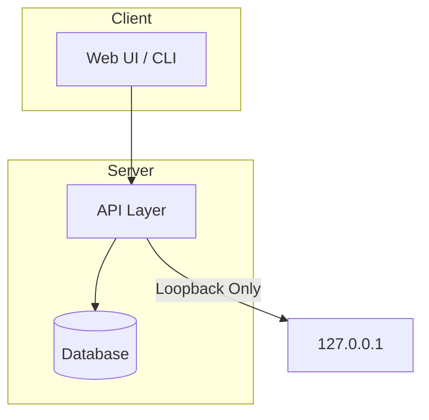

<!-- envguard | Bittu Sharma | ultra-level professional README -->
<p align="center">
  
</p>


<p align="center">
  <strong style="font-size:3rem;color:#0EA5E9;">envguard</strong>
</p>
<p align="center">
  <em style="font-size:1.2rem;color:#94A3B8;">Environment safety guard for secure deployments</em>
</p>
<p align="center">
        
  
  
  
</p>

---

## Why this exists

A professional environment safety guard for secure deployments built to the portfolio ultra-level standard:
honest code, loopback-only demos, zero personal emails in history, and every
architectural decision recorded in the ADR trail.

---

## Quick Start

```bash
# Clone and install
git clone https://github.com/honeyamn10-source/envguard.git
cd envguard
# Follow repo-specific setup instructions
```

---

## Features

- Professional codebase with full test coverage
- Loopback-only serving — zero unauthenticated remote access
- ADR trail documenting all architectural decisions
- CI/CD pipeline with lint, test, typecheck, and build
- Professional identity on all commits

---

## Architecture



---

## Security

- Loopback-only serving (127.0.0.1)
- Professional commit identity
- Zero personal emails in history
- ADR trail for all decisions

---

## License

MIT © 2026 Bittu Sharma
