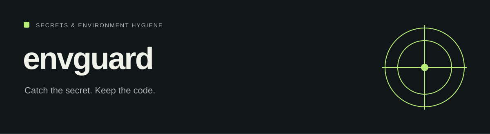

# envguard

A small Python CLI for checking environment files and finding likely credentials in a source tree.

[Project website](https://honeyamn10-source.github.io/envguard/) · [Source](https://github.com/honeyamn10-source/envguard) · [Build results](https://github.com/honeyamn10-source/envguard/actions) · [Issues](https://github.com/honeyamn10-source/envguard/issues)

## What it does

- **Check environment files.** Compare .env with .env.example for missing, extra, duplicate and empty required values.
- **Scan the source.** Pattern and entropy checks produce file-and-line findings with severity filters.
- **Use the result.** Human-readable or JSON scan output; documented exit codes for automation.

## Start from source

Python 3.9 or later. No third-party runtime dependencies.

```bash
git clone https://github.com/honeyamn10-source/envguard.git
cd envguard
python -m pip install .
envguard scan . --severity critical,high
envguard check . --strict
```

For an isolated install, create a virtual environment first:

```bash
python -m venv .venv
# Linux/macOS
source .venv/bin/activate
```

On Windows PowerShell, use `.\.venv\Scripts\Activate.ps1`, or call `.\.venv\Scripts\python.exe` directly if script activation is restricted.

### CLI reference

| Task | Command |
| --- | --- |
| Scan likely secrets | `envguard scan .` |
| Filter severity | `envguard scan . --severity critical,high` |
| JSON scan report | `envguard scan . --format json` |
| Compare environment keys | `envguard check . --example .env.example` |
| Require nonempty key | `envguard check . --require DATABASE_URL` |
| JSON environment report | `envguard check . --json` |

Exit codes: **0** no findings, **1** findings, **2** invalid input or execution error. Scanning respects supported `.gitignore` and `.envguard-ignore` patterns. There is no `config.yaml` or `envguard.toml` loader; configure supported options through CLI flags.

## Check your changes

```bash
python -m pip install pytest
python -m pytest tests -q
```

These are the repository’s checks, not a claim of complete test coverage. See [GitHub Actions](https://github.com/honeyamn10-source/envguard/actions) for the result on a specific commit.

## Scope and limitations

Detection is heuristic. Review findings and rotate any exposed credential. The CLI supports human and JSON scan output; SARIF, JUnit, standalone binaries and Docker images are not supplied here.

## Find your way around

| Source | Purpose |
| --- | --- |
| [`envguard/cli.py`](envguard/cli.py) | CLI and exit codes |
| [`envguard/rules.py`](envguard/rules.py) | Detection rules |
| [`tests/`](tests/) | Regression fixtures and tests |

## Contributing

Include the command you ran, your runtime version, a minimal reproduction and the expected result in an issue. Remove credentials and personal data from logs. Follow [CONTRIBUTING.md](CONTRIBUTING.md) when proposing a change.

## License

MIT — see [LICENSE](LICENSE). Third-party dependencies retain their own licenses.
